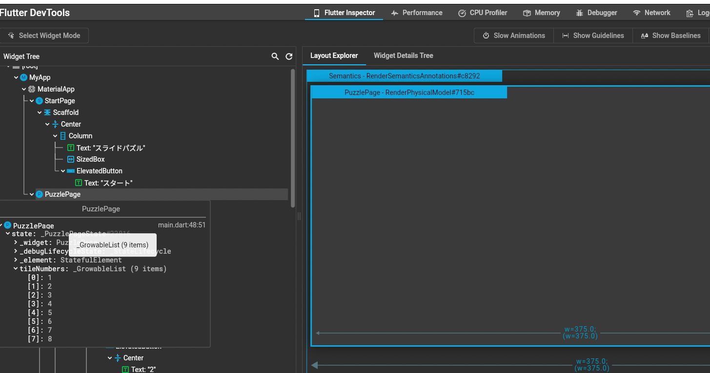

Software DesignのFlutterの記事の備忘録
## Flutterの特徴

- 独自のレンダリングシステム
  - Skiaという描画ライブラリが組み込まれた独自のレンダリングシステムがある
  - このおかげでネイティブでの実装と比較しても遜色ないパフォーマンスを実現
- 各プラットフォーム対応状況が進んでおり、1つのコードベースで複数のプラットフォームで動作する価値が高まっている
  - Android, iOS以外にもWeb, Windowsは安定版になっている
  - macOS, Linuxもベータ版として開発中
  - iOS/Androidエンジニア区別なく1つにまとまって少人数開発できる
  - プラットフォーム間の実装の差が生まれにくい
- Dart言語
  - Googleが開発している言語
  - Java, JavaScriptと似ている
  - Null Safety
    - Dart 2.12で入った
    - 予期せぬNullへの参照をビルド前にチェックできる
    - 非Null許容型とNull許容型を明確に区別している
      - Null型の変数を非Null型の変数に入れる時はNullチェックしないと代入できない
      ```dart
      String value = ''; // 非Null型
      String? nullableValue = null;

      if (nullableValue == null) {
        return
      }

      value = nullableValue;
      ```
- 他のクロスプラットフォーム(cordova, xamarin)に対する強み
  - ホットリロードによる圧倒的な生産性の高さ
  - DevTools
  - 初学者でも学習しやすい。公式Youtubeチャンネルもある
  - pub.devに高品質なパッケージがそろっている
  - iOS, Android固有の実装(ファイルシステム、加速度センサ、カメラなど)を呼び出せる
    - プラットフォーム固有の機能を呼び出すための機構を `Plugin` と呼んでいる
- UIの構築するあらゆる要素は `Widget` として表現される
  - Widgetツリーという構造
    - Widgetの下層に別のWidget(子Widget)を渡し、さらの孫WidgetにもWidgetを渡していくという流れで、アプリ全体のレイアウトが管理されている
    - 厳密にはツリー構造の本体はWidgetから生成されるElementというオブジェクト
      - FlutterはElementを上手く隠蔽して開発者がWidgetに集中できるようにしてくれている
- ホットリロードによる効率的な開発体験
  - ソースコード上で保存するだけで変更が反映される（いちいちコンパイルしなくて良い）

## UIアーキテクチャー

Flutterを構成する要素としてFramework層がある
そのFramework層にあるWidgets、Material、Cupertioについて


- Wigets
  - 基本となるシンプルなWidget
  - デザイナーが1からデザインしたブランド独自のデザインで利用
- Material
  - Wigetsのラッパーでマテリアルデザインを強く意識したWidget
  - AppBar, ElevatedButtonなど
- Cupertino
  - iOSが標準で提供するUIパーツをピクセル単位で再現したWidget
  - iOSの標準的なUIを再現することができる

## Flutter SDKのインストール

[こちら](https://docs.flutter.dev/get-started/install/macos)から最新版をDLてPathを通す
or homebrewで入れる

```
cd ~/development
unzip ~/Downloads/flutter_macos_arm64_3.0.5-stable.zip
```

or

```
brew install flutter
```

インストール完了したらFluter Dockerで現状確認
環境構築のために不足してくれる部分を指摘してくれる
現時点でAndroid SDKは対応していなかったり

```
🕙 22:52✗ flutter doctor
Running "flutter pub get" in flutter_tools...                       9.8s
Doctor summary (to see all details, run flutter doctor -v):
[✓] Flutter (Channel stable, 3.0.5, on macOS 12.4 21F79 darwin-arm, locale ja-JP)
[✗] Android toolchain - develop for Android devices
    ✗ Unable to locate Android SDK.
      Install Android Studio from: https://developer.android.com/studio/index.html
      On first launch it will assist you in installing the Android SDK components.
      (or visit https://flutter.dev/docs/get-started/install/macos#android-setup for detailed instructions).
      If the Android SDK has been installed to a custom location, please use
      `flutter config --android-sdk` to update to that location.

[✗] Xcode - develop for iOS and macOS
    ✗ Xcode installation is incomplete; a full installation is necessary for iOS development.
      Download at: https://developer.apple.com/xcode/download/
      Or install Xcode via the App Store.
      Once installed, run:
        sudo xcode-select --switch /Applications/Xcode.app/Contents/Developer
        sudo xcodebuild -runFirstLaunch
    ✗ CocoaPods not installed.
        CocoaPods is used to retrieve the iOS and macOS platform side's plugin code that responds to your plugin usage
        on the Dart side.
        Without CocoaPods, plugins will not work on iOS or macOS.
        For more info, see https://flutter.dev/platform-plugins
      To install see https://guides.cocoapods.org/using/getting-started.html#installation for instructions.
[✗] Chrome - develop for the web (Cannot find Chrome executable at /Applications/Google
    Chrome.app/Contents/MacOS/Google Chrome)
    ! Cannot find Chrome. Try setting CHROME_EXECUTABLE to a Chrome executable.
[!] Android Studio (not installed)
[✓] VS Code (version 1.68.1)
[✓] Connected device (1 available)
[✓] HTTP Host Availability
```

## Androidのセットアップ

android studioもbrewで入れる

```
brew install android-studio
```

Android Studioを起動させてセットアップウィザードを進め、再度flutter doctorを試す

```
🕙 22:57❯ flutter doctor
Doctor summary (to see all details, run flutter doctor -v):
[!] Android toolchain - develop for Android devices (Android SDK version 33.0.0)
    ✗ cmdline-tools component is missing
      Run `path/to/sdkmanager --install "cmdline-tools;latest"`
      See https://developer.android.com/studio/command-line for more details.
    ✗ Android license status unknown.
      Run `flutter doctor --android-licenses` to accept the SDK licenses.
      See https://flutter.dev/docs/get-started/install/macos#android-setup for more details.
[✓] Android Studio (version 2021.2)
```

android toolchainに注意マークが出てるので対応する
- androidのcommand-line toolが入ってないから入れろと言っているので、[こちら](https://qiita.com/ShortArrow/items/46ca3717384039419605#android-sdk%E3%81%95%E3%82%93%E3%81%AB%E9%A0%BC%E3%81%A3%E3%81%A6%E3%81%BF%E3%82%8B)を参考にしてAndroidStudioのPreferenceから入れる
- 上記対応後にライセンス許諾するコマンド実行する
  ```
  flutter doctor --android-licenses
  ```

## Xcodeのインストール

- AppStoreからXcodeをダウンロードしてインストール
- Xcode付属のコマンドラインツールを最新版にしてライセンスに同意
  ```
  sudo xcode-select --switch /Applications/Xcode.app/Contents/Developer
  sudo xcodebuild -runFirstLaunch
  sudo xcodebuild -license
  ```
- flutter doctorで確認
  ```
  [!] Xcode - develop for iOS and macOS (Xcode 13.4.1)
    ✗ CocoaPods not installed.
        CocoaPods is used to retrieve the iOS and macOS platform side's plugin code that responds to your plugin usage
        on the Dart side.
        Without CocoaPods, plugins will not work on iOS or macOS.
        For more info, see https://flutter.dev/platform-plugins
  ```
  cocapodが無いと言われるのでbrewで入れる
  ```
  brew install cocoapods
  [✓] Xcode - develop for iOS and macOS (Xcode 13.4.1)
  ```

## Widgetでのコンストラクタ内のconstの意義

constをコンストラクタの呼び出しコードに付与することで
`コンパイル時に1つだけオブジェクトを準備して、何度同じステップが実行されてもオブジェクトが使い回される`
という重要な仕組みのために付けている
例えば、再描画が走った際に最初にコンストラクタで作成されたテキストやスペーサーオブジェクトを毎回生成し直すことはしない
各オブジェクトが再描画の判断を個々に行っている
これにより最適な再描画処理が行えている(無駄な再計算が発生しない)
Widgetのコンストラクタ内でconst使わないとLintに怒られるぐらい根本的な設計思想がある


```dart
Widget build(BuildContext context) {
    return MaterialApp(
      home: Scaffold(
        appBar:  AppBar(
          title: const Text('Plugin example app'),
        ),
        body: Padding(
          padding: const EdgeInsets.all(16.0),
          child: Column(
            children: [
              const Spacer(), // この辺
              const TextField(),
              const SizedBox(height: 32.0),
              ElevatedButton(
                onPressed: () {},
                child: const Text('保存')
              ),
              const Spacer()
            ]),
        ),
      ),
    );
  }
```

似た修飾子としてfinalがあるが、こちらは`実行時に生成したオブジェクトを1度だけ代入できる`というもの
constは実行前（コンパイル時）にオブジェクトを生成するという違いがあるので注意

## Flutterの状態管理について

FlutterのUIは公式がある

> UI = f(State)

UI: 最終的に画面に表示されるUI
f: buildメソッドによるWidgetの構築処理
State: buildメソッド内で参照される状態

UIはbuildメソッドの戻り値によって決定され、buildメソッドが状態を参照している
↓
UIを動的に変更する場合は

1. 状態を変更する
2. buildメソッドを呼び出す
3. buildメソッドが戻り値として再計算されたWidgetを返す

をしている
この一連のリビルドの流れのことを`状態管理`と言っている

### 宣言的なUI構築

buildメソッドのプログラムは
`この場合のUIはこうである`
と常に`宣言`している読み取ることができる
こうしたプログラミング手法のことは`宣言的`なUI構築と言われている

- どんな経緯であったとしても、状態とbuildメソッドを確認すれば最終的なアウトプットは決定できる
- 動的にUIを変更するためにすることが、状態の変更とリビルドだけとシンプル

### StatefulWidgetの課題

状態管理のために標準で用意されている

- 状態管理だけでなく、buildメソッドもStateクラスが担当するのでStateクラスが密結合になってしまう
- 複数のWidget間で状態を共有するためにはGlobalKeyを利用したりしないといけないためスパゲッティコード化しやすい

### InheritedWidget

StatefulWidgetの課題であった、状態を管理するWidgetと状態を利用するWidgetを分離する思想のWidget

- メリット
  - InheritedWidgetの子孫であればどのWidgetからもアクセスできるので状態を共有できる
  - 下層のどのWidgetからもO(1)でアクセスできる
    - O(1): 扱うデータ量がどれだけ大きくなっても処理量は変わらないこと
  - アクセスのあったWidgetをキャッシュし、状態が変化した場合にリビルドを発生させる
- デメリット
  - 状態を管理するコードとそれを利用するコードが分離して関連がわかりづらくなってしまう
  - InheritedWidgetを利用するためにボイラープレートコードを書く必要がある

### providerパッケージ

InheritedWidgetの課題を解決するために作られたInheritedWidgetのラッパー

- ボイラープレートコードの削減
- InheritedWidgetへの共通したアクセス手法の提供
- 開発ツールによる状態の可視性の向上

### riverpodパッケージ

providerはInheritedWidgetのラッパーという前提上、Flutterフレームワーク自体の設計に従わないといけない
それ故の使いづらさを解決するために作られた

- 同じ型の状態のオブジェクトを複数管理できる
- BuildContextとは別にProviderRefを利用することでも状態オブジェクトにアクセスできる
- テストのために状態オブジェクトの振る舞いを上書きできる
- 仕組みとしてはWidgetツリーとは独立していて、状態オブジェクトの生成や破壊の挙動などriverpod独自の仕組みのため使い方注意

### その他の状態管理パッケージ

[List of state management approaches](https://docs.flutter.dev/development/data-and-backend/state-mgmt/options)

## [flutterのテスト](https://docs.flutter.dev/testing)

テストの種類は主に3つ

- Unitテスト: 各クラス・メソッドのテスト
- Widgetテスト: Widget単位のテスト。Flutter特有のテスト
- Integrationテスト: アプリのテスト

### Widgetテスト

```dart
import 'package:flutter/material.dart';
import 'package:flutter_test/flutter_test.dart';

import 'package:myfirstapp/main.dart';

void main() {
  testWidgets('スタート画面が表示される', (WidgetTester tester) async {
    await tester.binding
        .setSurfaceSize(const Size(400, 800)); // テスト時の画面サイズが縦長になるように調整
    await tester.pumpWidget(const MyApp()); // pumpWidget()でMyAppをレンダリングする

    final titleFinder = find.text('スライドパズル'); // MyAppに指定の文字を含むWidgetがあることを確認
    final buttonFinder = find.text('スタート'); // MyAppに指定の文字を含むWidgetがあることを確認

    // find.textだと対象のWidgetが存在しない場合や複数存在した場合に正しくテストできない
    // そのため特定したWidgetが期待した内容であるかを判定するためにfindsOneWidgetというMacherを使う
    expect(find.text('スライドパズル'),
        findsOneWidget); // MyAppに指定の文字を含むWidgetが「1つ」あることを確認
  }); // WidgetのテストにはtestWidgetsを使う

  testWidgets('スタートボタンをタップするとパズル画面が表示される', (WidgetTester tester) async {
    await tester.binding
        .setSurfaceSize(const Size(400, 800)); // テスト時の画面サイズが縦長になるように調整
    await tester.pumpWidget(const MyApp()); // pumpWidget()でMyAppをレンダリングする

    final buttonFinder = find.text('スタート'); // MyAppに指定の文字を含むWidgetがあることを確認
    await tester.tap(buttonFinder); // テスト時にボタンをタップする
    await tester.pumpAndSettle(); // テスト時にボタンをタップ後に画面を更新、表示されるのを待つためのメソッド

    expect(find.text('1'), findsOneWidget); // MyAppに指定の文字を含むWidgetが「1つ」あることを確認
    expect(
        find.text('シャッフル'), findsOneWidget); // MyAppに指定の文字を含むWidgetが「1つ」あることを確認
  }); // WidgetのテストにはtestWidgetsを使う
}
```

flutter testコマンドでテスト実行

```sh
flutter test
00:01 +0: スタート画面が表示される
00:02 +0: スタート画面が表示される
00:02 +1: スタート画面が表示される
00:02 +1: All tests passed!
```

## DevTools

アプリをデバッグ起動している状態で以下のコマンドをターミナルから実行する

```sh
flutter run
```

以下の様なURLをクリックするよう案内される

```
The Flutter DevTools debugger and profiler on iPhone SE (3rd generation) is available at: http://127.0.0.1:9101?uri=http://127.0.0.1:57013/XOctQCj94pc=/
```

ブラウザで該当のURLをクリックすると以下のようなデバッグツールが表示される
Flutter InspectorタブではWidget Treeが確認できる
該当のWidgetをクリックして、カーソルを合わせるとWigetが持つプロパティ一覧が閲覧できる
現在保存されている値を確認したり、親子関係を把握するなどに有用

