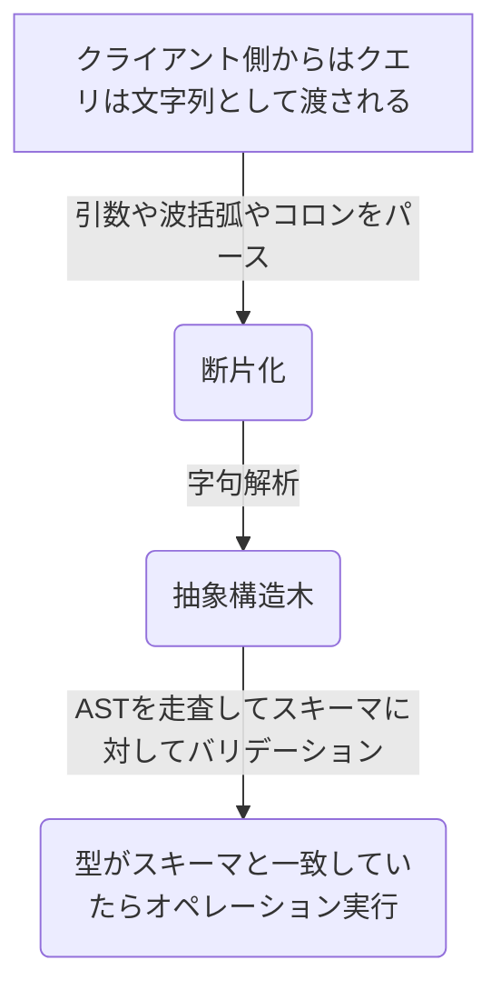

## はじめに

はじめてのGraphQLを読んで、章ごとに学んだことをメモする
途中で挫折することなく読み切るための備忘録

https://www.amazon.co.jp/dp/487311893X

## 付録：Relay

RelayはFacebookが作ったクライアントライブラリ
ReactやReact Nativeで活用しやすいようにGraphQLのSchemaの制約を追加しているのが特徴

### Global Object Identification

全データ共通のユニークなIDを付与するようにスキーマにNodeインターフェースを定義する
Query型のルートにnode(id: ID!): Nodeを追加する必要がある
これによりオブジェクト再取得を効率的にするもの
```graphql
type Query {
  node(id: ID!): Node! # nodeのIDのみでデータが取得できるように
}

interface Node {
  id: ID!
}

type User impliments Node {
  id: ID!
  name: String!
}
```

IDのフォマット設計も重要。ユニークである必要がる
例えば userのidが12345の場合、**USER:12345** という風にテーブル名をPrefixとして付与する
さらに、これをbase64でエンコードするのが典型とのこと


### Cursor Connections

カーソルベースのページングについての仕様のこと。
良くあるページベースのページングの場合、データ登録される頻度が高いとリクエストした時間の前後ですぐズレてしまう。  
(2ページ目の10件取得後に、新しいデータが登録されたら2ページ目の中身は本当の2ページ目ではない)
[スタディプラス開発者ブログのカーソルベースページング](https://tech.studyplus.co.jp/entry/2018/12/25/132345)の具体例が分かりやすいので参考になる。
ページングを順序通り表現できる反面、デメリットとしては全体の件数が取得できない。

ページングのルールとしては
1. xxxConnectionを持つ型を用意して返す
1. first: Int!とafter: Stringを引数に追加
1. カーソル情報の管理はEdge型フィールド
1. ページング情報の管理はPageInfo型フィールド

```graphql
type Query {
  repositories(
    # 次方向ページングのため
    first: Int
    after: String
    # 前方向ページングのため
    last: Int
    before: String
  ): RepositoryConnection
}

type RepositoryConnection {
  pageInfo: PageInfo
  edges: [RepositoryEdge]
}

type PageInfo {
  hasPreviousPage: Boolean!
  startCursor: String
  hasNextPage: Boolean!
  endCursor: String
}

type RepositoryEdge {
  cursor: String!
  node: Repository
}

type Repository {
  id: ID!
  name: String
}
```

### Mutations updater

Mutationは作成・更新・削除を行う。その際にクライアント側のキャッシュも一緒に変更を反映させたいよねというもの。
WEB+DB PRESS Vol.125のミューテーションの戻り値の項目が参考になる。

- 作成の場合は作成されたリソース全体を返す
  - relayは@appendEdge、@prependEdge、@appendNode、@prependNodeのディレクティブを利用すると良い
- 更新の場合も更新されたリソース全体を返す
  - relayの場合はNodeインターフェースを実装していれば良しなにキャッシュを更新してくれる
- 削除の場合はIDを返せば良い
  - 更新と同じで、Nodeインターフェースを実装していれば良しなにしてくれる

## 7章：GraphQLの実戦投入にあたって

### セキュリティ対策

- リクエストタイムアウト
  - リクエスト全体に対して制限を書けるか、リゾルバ毎に適用するかする
- データ制限(巨大なクエリ対策)
  - 100件以上は取得しないなどのでロジックを入れる
      ```graphql
      allPhotos: (root, data, context) {
        if (data.first > 100) {
          throw new Error("100件以上はリクエストできません");
        }
      }
      ```
- クエリ深さ制限
  - 無向グラフはメリットではあるがパフォーマンスに直結する
  - [graphql-depth-limit](https://www.npmjs.com/package/graphql-depth-limit)などを導入して意図しない深さのクエリが発行されないようにする
- クエリの複雑度を検知してアラート上がるようにしておく
  - [graphql-validation-complexity](https://www.npmjs.com/package/graphql-validation-complexity)
- GraphQLサービスのモニターによりパフォーマンス監視
  - ApolloはApollo Engineを利用することができるので便利

### Slack

- [GraphQL Slack](https://graphql-slack.herokuapp.com/)
- [Apollo Community](https://community.apollographql.com/)

## 5章：GraphQLサーバーの実装

### リゾルバ

スキーマはクライアントが作成できるクエリ操作と様々な型の関係性を定義
スキーマはデータの要件を記述するけどデータの取得作業はできない
その役割を担うのが **リゾルバ**
言い換えるとGraphQLのロジックを担当する部分
クエリを作成してエラーが出たらスキーマ定義を確認しよう

```graphql
# スキーマ定義
const typeDefs = `
  type Query {
    totalPhotos: Int!
  }
`

# リゾルバ
const resolvers = {
  Query: { # Queryオブジェクトで定義されているのでここも同じtypenameである必要がある
    totalPhotos: () => 50 # クエリを作成する場合はスキーマと同じ名前のリゾルバ関数にする必要がある
  }
}
```

#### トリビアルリゾルバ
オブジェクトをGraphQL側で拡張したいときに使う
Presenter的な役割(DBに保存されてないが表示用に使いたい)的な位置づけと一旦理解

```graphql
let photos = [
  {
    "id": "1",
    "name": "photo name",
  },
];

type Photo {
  id: ID!
  name: String!
  url: String!
}

type Query {
  allPhotos: [Photo!]!
}

query listPhotos {
  allPhotos {
    id
    name
    url
  }
}

const resolvers = {
  Query: {
    allPhotos: () => photos
  },
  Photo: {
    url: parent => `https://${parent.id}.com` # letで定義したphotosの中にurlフィールド無くても、resolverでPhotoオブジェクトを拡張することができる
  }
}
```

#### カスタムスカラー型

DateTimeなどGraphQL側が用意してない型を独自定義する場合の話
GraphQLScalarTypeを使って表現する
GraphQLScalarTypeで用意している3つのメソッドは要理解
- serialize: レスポンスに含める際に定義した関数に沿って処理
- parseValue: クライアント側から送信される値をパースする際の関数
- parseLiteral: クエリドキュメントに直接追加された場合の関数。最低限その値を返すだけで良い。

```graphql
const { GraphQLScalarType } = require(`graphql`);

type Query {
  allPhotos(after: DateTime): [Photo!]!
}

const resolvers = {
  DateTime: new GraphQLScalarType({
    name: `DateTime`,
    description: `A valid date time value.`,
    parseValue: value => new Date(value),
    serialize: value => new Date(value).toISOString(),
    parseLiteral: ast => ast.value,
  }),
  Query: {
    totalPhotos: () => photos.length,
    allPhotos: (_parent, args) => {
      console.log(args.after); # parseValueで処理された値が入っている
      return photos;
    }
  },
}
```

### コンテキスト

どのリゾルバもアクセスできるグローバルな情報(認証情報やDB情報、ローカルキャッシュなど)を保存する場所

こんな感じでDBクライアントをApolloServerに渡して起動させる
```js
const db = client.db()
const context = { db }
const server = new ApolloServer({typeDefs, resolvers, context})
```

リゾルバ側では第3引数が上記で渡されたcontextが参照できる仕組みなので、dbから値を参照するロジックが書ける
```graphql
Query: {
  totalPhotos: (parent, args, { db }) => db.collection(`photo`).estimatedDocumentCount()
}
```


## 4章：スキーマの設計

GraphQLスキーマは、どんなオペレーションがあってどんなフィールドが取得できるかを定義したもの
スキーマファイルは慣習で **.graphql** とされている

ID型は固有の識別子を格納するもの。JSONとしては文字列で返されるが、String型とは異なり値が重複しないことをバリデーションしてくれる
**!** はnullにならないの意(null成約)
```graphql
type Photo {
  id: ID!
  name: String!
  description: String
  numbers: [Int!]! # リストにもnull成約を付けることができる。べき論として配列の値がnullのみ場合は空配列にする。
}
```

IDやStringなどはスカラー型と呼ばれて、他に「Int、Float、Boolean」がある。
カスタムもできる
```graphql
scalar DateTime # カスタムスカラー型として定義

type Photo {
  id: ID!
  created: Datetime
}
```
よくあるカスタムスカラー型が実装されている[パッケージ](https://github.com/stylesuxx/graphql-custom-types)

Enumもある。よく見るEnumの定義の仕方と同じ
以下の場合、categoryにHOGEなどの定義外の値を入れるクライアントに返すことはできない
```graphql
enum PhotoCategory {
  SELFIE
  ACTION
  GRAPHIC
}

type Photo {
  id: ID!
  name: String!
  category: PhotoCategory!
}
```

### 多:多

Userは友人達の情報を持っていて、友人達はそれぞれどこで知り合ってどのぐらいの期間友人関係かを持っている
これをGraphQLで表現するとこんな感じになる
```graphql
type User {
  friends: [Friends!]!
}

type Friends: {
  friends: [User!]!
  howLong: Int!
  whereWeMet: Location
}
```

### ユニオン型 / インターフェース

3章でユニオン型やインターフェースでのQueryオペレーションについて学んだので、ここではそれをどうやって定義しているかについて記載されている

```graphql:ユニオン型
union AgendaItem = StudyGroup | Workout

type StudyGroup {
  name: String!
  subject: String!
}

type Workout {
  name: String!
  reps: Int!
}

type Query {
  agenda: [AgendaItem!]!
}
```

```graphql:インターフェース
interface AgendaItem {
  name: String!
  start: String!
  end: String!
}

# interfaceで定義したものは必ずフィールドとして含めないといけない
type StudyGroup impliments AgendaItem {
  name: String!
  start: String!
  end: String!
  topic: String!
}
```

### 引数

引数を使うことで絞り込みができる。書き方はシンプル
```graphql
# スキーマ
type Query {
  Photo(id: ID!): Photo! # IDが必須なのでない場合はGraphQLサーバー側でエラー
  allPhotos(category: PhotoCategory): [Photo!]! # categoryにnullが入ってきた場合はすべてのPhotoを返す
}

# Queryオペレーション
query {
  Photo(id: "hoge") {
    name
    description
  }
}
```

### データページングとソート

実際に運用していくと一度に取得できる件数の絞り込みが必要になってくる
ページングに必要な引数(mysqlでいうlimitやoffset)を定義してあげる
ソートも同じ要領で定義する
```graphql
enum SortDirection {
  DESC
  ASC
}

enum SortField {
  name
  createdAt
}

type Query {
  allUsers(first: Int=50 start: Int=0 sort: SortDirection = DESC sortBy: SortField = name): [User!]!
}
```

### 入力型

queryでもmutationでも運用していくと引数が多くなり非常に見づらくなる
そうした場合は入力型を使って入力値をまとめてあげると良い

```graphql
input PostPhotoInput {
  name: String!
  description: String
  category: PhotoCategory=PORTRAIT
}

type Mutation {
  postPhoto(input: PostPhotoInput!): Photo!
}

# Mutationの実行
mutation newPhoto($input: PostPhotoInput!) {
  postPhoto(input: $input) {
    id
    name
    createdAt
  }
}
```

### 返却型

レスポンスの型もカスタムで作れるという話

```graphql
type AuthPayload {
  user: User!
  token: String!
}

type Mutation {
  githubAuth(code: String!): AuthPayload!
}
```

### スキーマのドキュメント化

3章のイントロスペクションでGraphQLクライアントツールから定義が閲覧できたと思うが、その際に定義書をより分かりやすくできるようにコメントを追加できる。
コメント部分が定義書にも反映されるので便利

```graphql
type User {
  """
  ユーザーのユニークなGitHubログインID
  """
  githubLogin: ID!
}

type Mutation  {
  githubAuth(
    "code(引数)に対してもコメント付けれる"
    code: String!
  ): AuthPayload!
}
```


## 3章：GraphQLの問い合わせ言語

|項目|memo|
|---|---|
|SQL|DBに対してデータを操作するための言語|
|REST|SQLの考えを受け継いで、クエリではなくURLのエンドポイントに対してデータ操作をする考え方|
|GraphQL|SQLの考えを受け継いだインターネットのための問い合わせ言語(DB、ファイル、REST API、WebSocketなどあらゆるモノに対する問い合わせ)|

|機能|SQL|GraphQL|memo|
|---|---|---|---|
|検索|Select|Query|dataフィールドにリクエスト結果が入っている。エラーはerrorフィールド|
|登録|Create|Mutation||
|更新|Update|Mutation||
|削除|Delete|Mutation||
|監視| - |Subscription|ソケット通信でデータの変更を検知するもの(SQLにはない)|


### GraphQL実行ツール

|ツール名|memo|
|---|---|
|[GraphiQL](https://github.com/graphql/graphiql)|Facebook社製|
|[GraphQL Playground](https://github.com/graphql/graphql-playground)|Prismaチーム製。Web版は[こちら](https://www.graphqlbin.com/v2/new)|
|[Altair GraphQL Client](https://github.com/altair-graphql/altair)|最近使っているやつ。すべてのプラットフォームに対応している|

上記のツールはAPIスキーマの定義書を表示してくれる
これは裏側でGraphQLのイントロスペクションという機能を使っている
具体的にはAPIのスキーマを返すQueryオペレーションを実行している

```graphql: イントロスペクションの例
query {
  __schema {
    types {
      name
      description
    }
  }
}
```

### 公開 GraphQL API

GraphQLのスキーマの参考になる[一覧](https://github.com/APIs-guru/graphql-apis)


### Queryオペレーション

```graphql: 選択セット、クエリ引数、スカラー型、オブジェクト型
query lifts {
  allLifts(status: ClOSED) { # status: CLOSED部分がクエリ引数(クエリ結果をフィルタリングしたいとき)
    name
    status
  }
  trailAccess { # 選択セット(波括弧部分のこと) start
    name
    difficulty
  }             # 選択セット end
  Lift(id: "jazz-cat") {
    capacity      # スカラー型：Int, Float, String, Boolean, ID型からなる
    trailAccess { # オブジェクト型： 1つ以上のフィールドの集合
      name
      difficulty
    }
  }
}
```

フラグメントはフィールドが冗長化している時に有効
1つの修正で一気に変更が適応できる

```graphql: フラグメント
fragment liftInfo on Lift {
  name
  status
}

query {
  Lift(id: "jazz-cat") {
    ...liftInfo
  }
  Trail(id: "river-run") {
    name
    difficulty
    accessedByLifts {
      ...liftInfo
    }
  }
}
```

こういうリストの中身に異なる型を持つ場合への対応策としてユニオン型
```
[
  {
    "name": "Cardio",
    "repos": 100
  },
  {
    "name": "Comp Sci",
    "subject": "Computer Science",
    "students": 12
  }
]
```

```graphql:ユニオン型
query schedule {
  agenda {
    ...on Workout { # フラグメントを選択セットの中に書き込む方法(インラインフラグメント)
      name
      reps
    }
    ...on StudyGroup {
      name
      subject
      students
    }
  }
}
```

一方で必須のフィールド以外に任意のフィールドが入ってくる場合がある時はインターフェース
```
[
  {
    "name": "hoge",
    "start": 10,
    "end": 30,
  },
  {
    "name": "hoge",
    "start": 10,
    "end": 30,
    "memo": "fuga"
  },
]
```

```graphql
query schedule {
  agenda {
    name
    start
    end
    ...on Workout {
      memo
    }
  }
```

### Mutationオペレーション

変数は$で始まる
動的にパラメーターを埋め込める

```graphql
mutation createSong($title: String! $numberOne: Int) {
  addSong(title:$title, numberOne:$numberOne) {
    id
    title
    numberOne
  }
}
```

### Subscriptionオペレーション

Facebookのいいね数をリアルタイムで反映する仕組みとして利用
表示時にSubscriptionでいいね数を監視
いいね数が更新されるとSubscriptionを実行しているクライアントに対してデータがpushされる
クライアントは通知を受けて表示を更新するという仕組み

Subscriptionで購読する


別タブで値を更新する


Subscriptionしたタブで新しい値が流れてきているのがわかる


### 抽象構造木(AST: Abstract Syntax Tree)

> curl -X POST -d "{ \"query\": \"query { viewer { login }}\"}" https://hoge.com/graphql

クエリ自体は上記の様に文字列で送られてくる
それをどうやって解釈しているかの話

抽象構造木は構文構造をデータ構造に起こしたもの
DOMツリーの様に要素毎に意味を持ち階層化されているというのがイメージしやすい

一覧のフローを図示



## 2章：グラフ理論

GraphQLのコンセプトであるグラフ理論についての章
注釈にもあるようにこの章を読まなくても使うことへの支障はない

- [グラフ理論](https://ja.wikipedia.org/wiki/%E3%82%B0%E3%83%A9%E3%83%95%E7%90%86%E8%AB%96)
  - 人や物、アイディアなどのオブジェクト同士の関係性を形式的に表現することで理解を深めることができる
  - 四角や丸のオブジェクトをそれぞれ線で結びつけるだけだが、登場人物が多くなってくると視認性抜群のグラフになる
    - 組織図や家系図などが分かりやすい（文章だと即時に理解はできない）
  - Facebookのユーザーは複数のユーザーと繋がっていて、そのユーザーも別の友だちと繋がっている(無方向のグラフ)
    - オブジェクトと関連が複雑に組み合う中で、必要な情報を必要に応じて取得したいというニーズはGraphQLのクエリからも読み取れる


## 1章： GraphQLへようこそ

- Facebookが作成したクエリ言語
  - 最初はRESTで作っていたが、作り直し時に性能の課題とデータ構造の要件を満たす解決策として誕生
  - 今では広く普及しGithubのAPIもv4からGraphQLになるほど浸透
- RESTのデメリット
  - 欲しい情報を取得するためにAPIを複数呼び出すパターン
    - 一覧→詳細の順にAPIをコールする例
  - 追加開発する際にクライアントとサーバーのコミュニケーションコストがかかる
    - 既存のAPIだとレスポンスの中身を最適化できないから、新しくエンドポイントを作る場合
- 既存のサービスをGraphQLに一気に置き換えるのではなく、併用するパターンで移行作業している
  - GraphQLサーバーでリクエストを受けてRESTに流すBFFの構成

- GraphQLのクライアントで有名なもの
  - [Relay](https://relay.dev/)
  - [Apollo](https://www.apollographql.com/)
