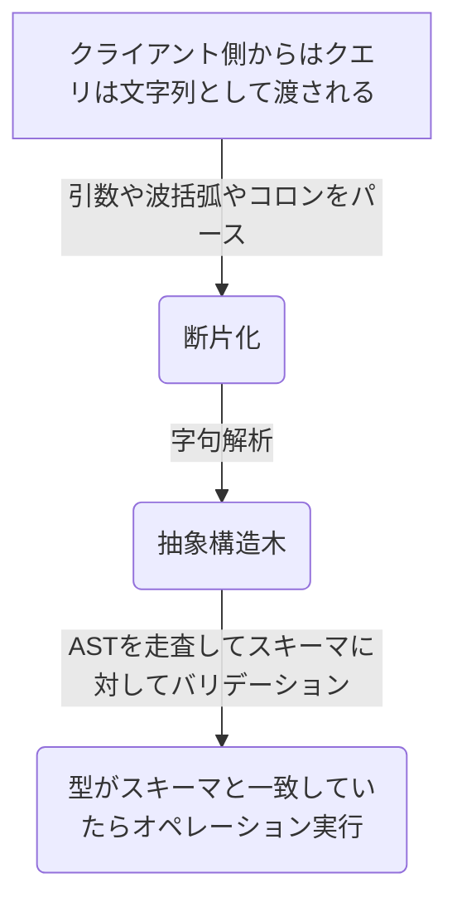

## はじめに

はじめてのGraphQLを読んで、章ごとに学んだことをメモする
途中で挫折することなく読み切るための備忘録

https://www.amazon.co.jp/dp/487311893X

## 4章：スキーマの設計

GraphQLスキーマは、どんなオペレーションがあってどんなフィールドが取得できるかを定義したもの
スキーマファイルは慣習で **.graphql** とされている

ID型は固有の識別子を格納するもの。JSONとしては文字列で返されるが、String型とは異なり値が重複しないことをバリデーションしてくれる
**!** はnullにならないの意
```graphql
type Photo {
  id: ID!
  name: String!
  description: String
}
```

IDやStringなどはスカラー型と呼ばれて、他に「Int、Float、Boolean」がある。
カスタムもできる
```graphql
scalar DateTime # カスタムスカラー型として定義

type Photo {
  id: ID!
  created: Datetime
}
```
よくあるカスタムスカラー型が実装されている[パッケージ](https://github.com/stylesuxx/graphql-custom-types)

## 3章：GraphQLの問い合わせ言語

|項目|memo|
|---|---|
|SQL|DBに対してデータを操作するための言語|
|REST|SQLの考えを受け継いで、クエリではなくURLのエンドポイントに対してデータ操作をする考え方|
|GraphQL|SQLの考えを受け継いだインターネットのための問い合わせ言語(DB、ファイル、REST API、WebSocketなどあらゆるモノに対する問い合わせ)|

|機能|SQL|GraphQL|memo|
|---|---|---|---|
|検索|Select|Query|dataフィールドにリクエスト結果が入っている。エラーはerrorフィールド|
|登録|Create|Mutation||
|更新|Update|Mutation||
|削除|Delete|Mutation||
|監視| - |Subscription|ソケット通信でデータの変更を検知するもの(SQLにはない)|


### GraphQL実行ツール

|ツール名|memo|
|---|---|
|[GraphiQL](https://github.com/graphql/graphiql)|Facebook社製|
|[GraphQL Playground](https://github.com/graphql/graphql-playground)|Prismaチーム製。Web版は[こちら](https://www.graphqlbin.com/v2/new)|
|[Altair GraphQL Client](https://github.com/altair-graphql/altair)|最近使っているやつ。すべてのプラットフォームに対応している|

上記のツールはAPIスキーマの定義書を表示してくれる
これは裏側でGraphQLのイントロスペクションという機能を使っている
具体的にはAPIのスキーマを返すQueryオペレーションを実行している

```graphql: イントロスペクションの例
query {
  __schema {
    types {
      name
      description
    }
  }
}
```

### 公開 GraphQL API

GraphQLのスキーマの参考になる[一覧](https://github.com/APIs-guru/graphql-apis)


### Queryオペレーション

```graphql: 選択セット、クエリ引数、スカラー型、オブジェクト型
query lifts {
  allLifts(status: ClOSED) { # status: CLOSED部分がクエリ引数(クエリ結果をフィルタリングしたいとき)
    name
    status
  }
  trailAccess { # 選択セット(波括弧部分のこと) start
    name
    difficulty
  }             # 選択セット end
  Lift(id: "jazz-cat") {
    capacity      # スカラー型：Int, Float, String, Boolean, ID型からなる
    trailAccess { # オブジェクト型： 1つ以上のフィールドの集合
      name
      difficulty
    }
  }
}
```

フラグメントはフィールドが冗長化している時に有効
1つの修正で一気に変更が適応できる

```graphql: フラグメント
fragment liftInfo on Lift {
  name
  status
}

query {
  Lift(id: "jazz-cat") {
    ...liftInfo
  }
  Trail(id: "river-run") {
    name
    difficulty
    accessedByLifts {
      ...liftInfo
    }
  }
}
```

こういうリストの中身に異なる型を持つ場合への対応策としてユニオン型
```
[
  {
    "name": "Cardio",
    "repos": 100
  },
  {
    "name": "Comp Sci",
    "subject": "Computer Science",
    "students": 12
  }
]
```

```graphql:ユニオン型
query schedule {
  agenda {
    ...on Workout { # フラグメントを選択セットの中に書き込む方法(インラインフラグメント)
      name
      reps
    }
    ...on StudyGroup {
      name
      subject
      students
    }
  }
}
```

一方で必須のフィールド以外に任意のフィールドが入ってくる場合がある時はインターフェース
```
[
  {
    "name": "hoge",
    "start": 10,
    "end": 30,
  },
  {
    "name": "hoge",
    "start": 10,
    "end": 30,
    "memo": "fuga"
  },
]
```

```graphql
query schedule {
  agenda {
    name
    start
    end
    ...on Workout {
      memo
    }
  }
```

### Mutationオペレーション

変数は$で始まる
動的にパラメーターを埋め込める

```graphql
mutation createSong($title: String! $numberOne: Int) {
  addSong(title:$title, numberOne:$numberOne) {
    id
    title
    numberOne
  }
}
```

### Subscriptionオペレーション

Facebookのいいね数をリアルタイムで反映する仕組みとして利用
表示時にSubscriptionでいいね数を監視
いいね数が更新されるとSubscriptionを実行しているクライアントに対してデータがpushされる
クライアントは通知を受けて表示を更新するという仕組み

Subscriptionで購読する


別タブで値を更新する


Subscriptionしたタブで新しい値が流れてきているのがわかる


### 抽象構造木(AST: Abstract Syntax Tree)

> curl -X POST -d "{ \"query\": \"query { viewer { login }}\"}" https://hoge.com/graphql

クエリ自体は上記の様に文字列で送られてくる
それをどうやって解釈しているかの話

抽象構造木は構文構造をデータ構造に起こしたもの
DOMツリーの様に要素毎に意味を持ち階層化されているというのがイメージしやすい

一覧のフローを図示



## 2章：グラフ理論

GraphQLのコンセプトであるグラフ理論についての章
注釈にもあるようにこの章を読まなくても使うことへの支障はない

- [グラフ理論](https://ja.wikipedia.org/wiki/%E3%82%B0%E3%83%A9%E3%83%95%E7%90%86%E8%AB%96)
  - 人や物、アイディアなどのオブジェクト同士の関係性を形式的に表現することで理解を深めることができる
  - 四角や丸のオブジェクトをそれぞれ線で結びつけるだけだが、登場人物が多くなってくると視認性抜群のグラフになる
    - 組織図や家系図などが分かりやすい（文章だと即時に理解はできない）
  - Facebookのユーザーは複数のユーザーと繋がっていて、そのユーザーも別の友だちと繋がっている(無方向のグラフ)
    - オブジェクトと関連が複雑に組み合う中で、必要な情報を必要に応じて取得したいというニーズはGraphQLのクエリからも読み取れる


## 1章： GraphQLへようこそ

- Facebookが作成したクエリ言語
  - 最初はRESTで作っていたが、作り直し時に性能の課題とデータ構造の要件を満たす解決策として誕生
  - 今では広く普及しGithubのAPIもv4からGraphQLになるほど浸透
- RESTのデメリット
  - 欲しい情報を取得するためにAPIを複数呼び出すパターン
    - 一覧→詳細の順にAPIをコールする例
  - 追加開発する際にクライアントとサーバーのコミュニケーションコストがかかる
    - 既存のAPIだとレスポンスの中身を最適化できないから、新しくエンドポイントを作る場合
- 既存のサービスをGraphQLに一気に置き換えるのではなく、併用するパターンで移行作業している
  - GraphQLサーバーでリクエストを受けてRESTに流すBFFの構成

- GraphQLのクライアントで有名なもの
  - [Relay](https://relay.dev/)
  - [Apollo](https://www.apollographql.com/)
