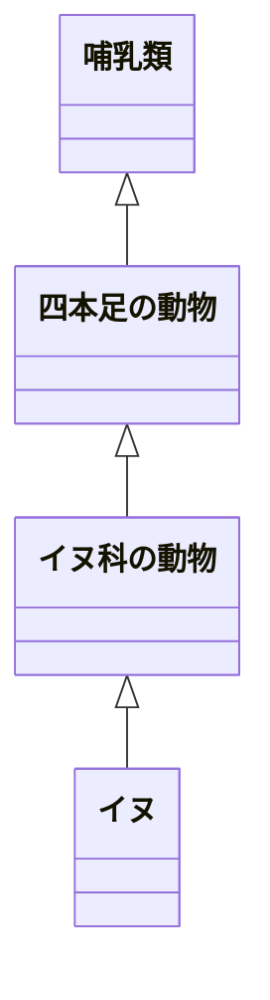
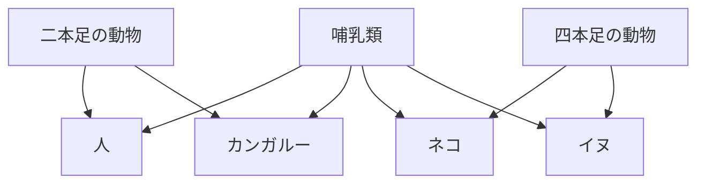

## はじめに

プロフェッショナルPython ソフトウェアデザインの原則と実践 を読んで気になったところのメモ

https://www.amazon.co.jp/dp/4295012637

## 第2章 関心の分離

### 特定のモジュール内のすべての名前をインポートするのはアンチパターン

このやり方だと名前の衝突が起きてしまう

```py
from <モジュール名> import *
```

### 関心の分離について

クラスの凝集度が高い（関連するものがそのクラスにまとまっている / 上手く関心が分離されている）は基本的に好ましい
関心の多すぎるクラスは、クラスの意図や意味合いがボケてしまう（低凝集度）
クラスを作る基準は、クラスで扱うデータや振る舞いの関係性が分かっていて、凝集度が高くなりそうだなと判断できるとき

### 疎結合

あるクラスが別のクラスの詳細に依存していることを`密結合`という（その反対が`疎結合`）
他方に変更を加えるともう一方に影響してしまう場合容易に管理が煩雑になることが想定されるのでアンチパターン

## 第3章

### 継承と合成

犬は4本足の動物であり、哺乳類であり、イヌ科の動物
継承関係で表現すると



しかし、哺乳類は4本足のものだけとは限らない
そうした動物が増えると途端に継承は使いづらくなる
継承は、階層構造がはっきりしている場合は有効だが変更への柔軟性は低い（硬直化したコードを生みやすい）

8章で継承の意味が説明されているが
- コードの再利用のためだけにサブクラスを使うのは間違い
- メソッドが異なる値を返したい（異なるふるまいにしたい時）に継承を使う

ふるまいについて考え方としては
クラスBがクラスAを継承しているとき、`B is an A`の関係が成り立つかをみる
Bは実際にAのインスタンスであるから、Bを見た時にAのように見える必要があるということ
これを置換可能性という概念として提唱している人もいる
-> あるクラスのインスタンスを、そのサブクラスのインスタンスと交換できなくてはいけない

8章2.3で継承が使える理想的なケースとして

1. 浅く狭い階層構造である
2. サブクラスは他のオブジェクトを利用していない
3. サブクラスはスーパークラスのすべてのふるまいを利用している

一方で合成の場合は特徴が独立しているので必要に応じて組み合わせが可能
将来新しいパターンがでてきた場合への対応は柔軟が高い
昨今では合成を多用する開発者は増えている



## 第4章

### 計算量

入力値の個数に`比例`して処理時間が増えていくとは限らない
入力値の個数に対して指数関数的に時間が増えていく場合のロジックの方が多いんじゃないかと思ったりもする
そんなアルゴリズムの良し悪しを評価する指標が計算量
O記法（オーダー記法）として広く知られているもの
こんな図を見たことが一度はあるかもしれない


例えばO(n^2)は「n自乗のオーダー」と読み、入力の個数nに対して n^2 に比例する割合で計算量が増えていくという意味になる
以下はO(n^2)の例でhogeの中身の最後が一致する場合すべての要素に対して比較が行われることになる
```py
for idx1, item1 in enumerate(hoge):
  for idx2, item2 in enumerate(hoge):
    if item1 == item2 and idx1 != idx2:
      return True
return False
```
↑は時間計算量と言われる入力数に応じて計算量がどのように増えていく指標の話
計算量には`空間計算量`というものもある
違いは、入力のサイズが大きくなるに連れてディスクスペースあるいはメモリがどの程度使用されていくかを表すもの

hoge.txtが1000行ぐらいだったら大したことないが、100億レコードあったら10Gぐらいはメモリ使うため非効率
```py
count = {}
with open('hoge.txt') as file:
  colors = file.read().splitlines()
for color in colors:
  if color in count:
    count[color] += 1
  else:
    count[color] = 1
```

メモリを効率良く利用するには、ファイルを1行ずつメモリに読み込んで処理するロジックに変える必要がある

### メモリの効率化のためにジェネレータを使う

上記の例のようにリストに対してfor文使いがちだけど、ジェネレータに置き換えできるロジックにならないかを考えてみるは良い心がけ
ジェネレータについてはrangeという組み込み関数で理解するのが入門としては分かりやすい

```py
hoge = [1,2,3,4,5]
for num in hoge:
  print(num)

for num in range(1,5):
  print(num) # 都度メモリから破棄される
```

どっちも処理としては同じだがrangeの方がメモリの使用効率は良い
なぜかというと、リストの場合は1~5の数字を一度メモリに保存している
一方で、rangeの場合は最初と最後の数字を覚えておいて、イテレーション毎に対象の数字をメモリに展開する
そして次に移ったら使い終わった数字をメモリ上から破棄するという挙動になる

```py
def squares(items):
  for item in items:
    yield item ** 2

for num in squares(range(1000)):
  print(num)
```

yieldが出てくるとジェネレータ感が出てくる
rangeは先程の考え方と同じでイテレーションする度にメモリに展開され、利用されたら破棄される
今回はそのrangeの値が自乗されているところ
yieldはイテレーションで呼ばれたら都度値を生成してしますよ
それまで待機してますよの意味
次のイテレーションに入ったら過去のデータはメモリから開放しますよ
なので中身としてはrangeの考え方と同じ

### 抽象化

リファクタリングの観点として冗長なコードをまとめる抽象化の作業がある
なんでも抽象化するのは実はあまり打ち手として良くなかったりする
所謂`早すぎる抽象化`と呼ばれるもの
ではどんな基準がある？でいうと「rule of three」という3回同じようなものを実装したら抽象化すべきだという考え方があるので参考に

### 処理時間の計測

0から999を全部足す処理時間は9.35マイクロ秒
こんな感じでtimeitを使えば処理時間を計測できボトルネックを探す手助けになる
なるべく複数回実行し平均を見るのが良い

```py
python -m timeit "total = sum(range(1000))"
50000 loops, best of 5: 9.35 usec per loop
```

### CPUプロファイリング

timeitより全体に範囲を広げて詳細に見ていきましょう

```py
import time
import random

def hoge():
  random_time = random.random() / 100
  time.sleep(random_time)

for _ in range(1000):
  hoge()
```

ncalls : 何回呼ばれたか
tottime : 合計でどのくらいの時間が消費されたか
percall : ncalls回を分母に平均消費時間
cumtime : 累積の消費時間

```
python -m cProfile --sort cumtime hoge.py
         4361 function calls (4334 primitive calls) in 6.982 seconds

   Ordered by: cumulative time

   ncalls  tottime  percall  cumtime  percall filename:lineno(function)
      3/1    0.000    0.000    6.982    6.982 {built-in method builtins.exec}
        1    0.003    0.003    6.982    6.982 hoge.py:1(<module>)
     1000    0.004    0.000    6.173    0.006 hoge.py:4(hoge)
     1000    6.168    0.006    6.168    0.006 {built-in method time.sleep}
      6/1    0.000    0.000    0.806    0.806 <frozen importlib._bootstrap>:1002(_find_and_load)
      6/1    0.000    0.000    0.806    0.806 <frozen importlib._bootstrap>:967(_find_and_load_unlocked)
      6/1    0.000    0.000    0.806    0.806 <frozen importlib._bootstrap>:659(_load_unlocked)
      2/1    0.000    0.000    0.806    0.806 <frozen importlib._bootstrap_external>:844(exec_module)
     10/1    0.000    0.000    0.801    0.801 <frozen importlib._bootstrap>:220(_call_with_frames_removed)
```

sleepやrandom_timeの計算は1000回呼ばれていて、sleepの所で全体の処理時間のほとんどである6.168を消費していることが分かる
